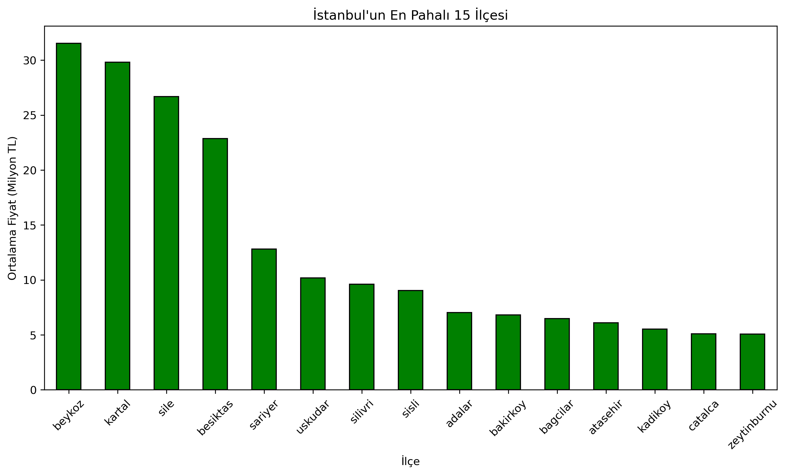

# Istanbul House Price Analysis 🏠🇹🇷

This project involves an Exploratory Data Analysis (EDA) of real estate prices in Istanbul using Python. The goal is to clean raw data, handle outliers, and visualize price distributions across different districts to understand the market dynamics.

## 🎯 Project Goals
- **Data Cleaning:** Converting object types to numeric, removing currency symbols ('TL'), and handling missing values.
- **Statistical Analysis:** Examining the distribution of prices and identifying skewness.
- **Outlier Detection:** Removing the top 5% extreme values (luxury properties/errors) to normalize the dataset.
- **Visualization:** Comparing average prices by district.

## 🛠️ Technologies Used
* **Python 3.x**
* **Pandas** (Data Manipulation)
* **NumPy** (Numerical Analysis)
* **Matplotlib** (Data Visualization)
* **Jupyter Notebook**

## 📊 Key Findings & Visuals

The analysis revealed a right-skewed distribution in house prices. After winsorizing the outliers, the price distribution became more observable.

**Price Distribution by District:**
*(Please ensure 'istanbul_ev_fiyatlari.png' is uploaded to the repository for this image to appear)*



## 🚀 How to Run
1. Clone the repository:
   ```bash
   git clone [https://github.com/ergunungor/istanbul-house-prices.git](https://github.com/ergunungor/istanbul-house-prices.git)

Author
Ergün Üngör

Mathematics Engineering Student @ Yıldız Technical University

Focus: Data Science & Algorithm Analysis

This project is part of my data science portfolio.
